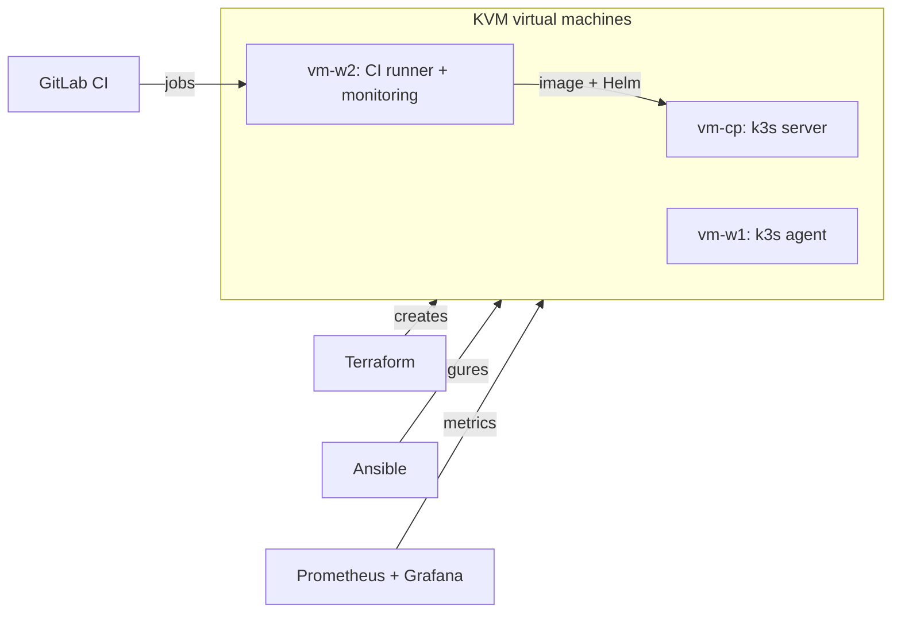

# onprem-infra-platform

On-prem infrastructure built from scratch on KVM virtual machines — the way many companies run their own servers.
The project grows week by week: every stage adds one layer and is documented, including what broke and how it was fixed.

> **Status:** early stage. Only what is marked **Done** actually exists in this repository.

## Roadmap

| Stage | Scope | Status |
|---|---|---|
| 1 | Repository setup: structure, `.gitignore`, secret scanning before every commit (gitleaks + pre-commit) | **Done** |
| 2 | Bash: operational scripts (path checks, log analysis, disk alerts, service checks, backups with rotation); three KVM VMs | In progress |
| 3 | Ansible: configure all VMs with one command; Docker: containerized app | Planned |
| 4 | Kubernetes (k3s) deployed by Ansible, Helm chart, GitLab CI pipeline | Planned |
| 5 | Monitoring (Prometheus, Grafana, Alertmanager), Terraform for VMs, incident drills | Planned |

## Target architecture

This is the goal of the project, not the current state.



## Getting started

Requirements (Ubuntu 24.04):

```bash
sudo apt install git shellcheck gitleaks pre-commit
```

Clone and enable the secret-scanning hook. Git hooks live in `.git/hooks` and are not cloned, so this step is required after every clone:

```bash
git clone https://github.com/tenmongit/onprem-infra-platform.git
cd onprem-infra-platform
pre-commit install
```

## Repository structure

```text
.
├── scripts/            # Bash operational scripts
├── docs/
│   └── incidents/      # Incident write-ups: symptom, diagnosis, fix, prevention
├── .gitignore          # secrets, heavy artifacts, generated files
└── .pre-commit-config.yaml  # gitleaks scan of staged changes
```

## Principles

- **No secrets in git.** State files, keys, kubeconfigs and `.env` files are ignored; staged changes are scanned by gitleaks before every commit.
- **Everything reproducible.** Manual steps are documented first, then automated.
- **Break it on purpose.** Each stage includes at least one incident drill, written up in `docs/incidents/`.
